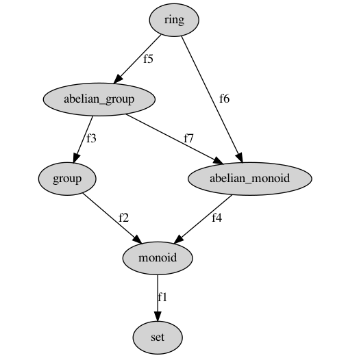

This is an just a small experiment to learn coq plugins.

## Drawing Coercion graph

For example if we have defined the following coercions 
between algebraic structures

```coq
Variable set:Type.
Variable monoid:Type.
Variable group:Type.
Variable abelian_group:Type.
Variable abelian_monoid:Type.
Variable ring:Type.

Variable f1:monoid->set.
Coercion f1:monoid >-> set.

Variable f2:group->monoid.
Coercion f2:group>->monoid.

Variable f3:abelian_group -> group.
Coercion f3:abelian_group >-> group.

Variable f4:abelian_monoid -> monoid.
Coercion f4:abelian_monoid >-> monoid.

Variable f5:ring -> abelian_group.
Coercion f5:ring >-> abelian_group.

Variable f6:ring -> abelian_monoid.
Coercion f6:ring >-> abelian_monoid.

Variable f7:abelian_group -> abelian_monoid.
Coercion f7:abelian_group >-> abelian_monoid.
```
Whe can ask coq to print the coercion graph using the command `Print Graph` but he do it textualy.
```
Coq < Print Graph.                      
[f7] : abelian_group >-> abelian_monoid
[f3] : abelian_group >-> group
[f3; f2] : abelian_group >-> monoid
[f3; f2; f1] : abelian_group >-> set
[f4] : abelian_monoid >-> monoid
[f4; f1] : abelian_monoid >-> set
[f2] : group >-> monoid
[f2; f1] : group >-> set
[f1] : monoid >-> set
[f5] : ring >-> abelian_group
[f6] : ring >-> abelian_monoid
[f5; f3] : ring >-> group
[f5; f3; f2] : ring >-> monoid
[f5; f3; f2; f1] : ring >-> set
```
This plugin just allows to have a graphical representation (dot format that can be converted or visualised).




     